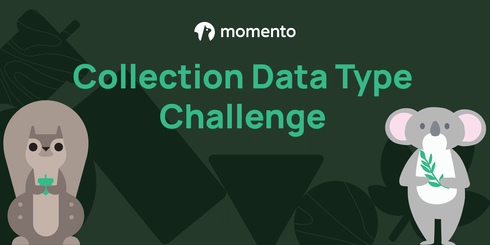

In this challenge, show your skills with your knowledge of how to use Momento's [collection data types](https://docs.momentohq.com/develop/datatypes#collection-data-types-cdts). Momento has four collection data types:

* **Dictionary** - A field/value object store that allows you to “pick and choose” individual key values for gets and sets
* **List** - An array that allows duplicate elements and remembers the order they were inserted
* **Set** - An unordered array that stores distinct elements
* **Sorted Set** - An array of distinct elements ordered by a *score*

## The Challenge

You are a computer science intern at the Melbourne zoo. The zoo has recently begun optimizing its workload by introducing a cache in their web services but ran into some errors in the implementation. It is your job to fix the errors made by the zookeepers so they can stay organized and work as fast as the cheetahs on exhibit.

### Objectives

There are three objectives to complete in this challenge with varying degrees of difficulty. Each objective presents you with multiple choices to satisfy the problem. You just have to uncomment the line you think best satisfies the problem and replace some placeholders.

**Objective 1**

Create a collection that stores the unique animal species from the `melbourneZooAnimals` array

*Description*

You are provided with an array of animal species, but it contains duplicates! We want to see a list of unique animals on display at the Melbourne Zoo. You need to figure out which data type is the right one to use and add all the provided values to it. 

*Your task*

Comment out the line that best fits the victory conditions below and fill in the placeholders with the correct values.

*Victory conditions*

* You create a collection item in the `animal` cache with the name `species`.
* The `species` cache item is the correct collection data type (set, list, or dictionary).
* The `species` cache item has only the distinct animal species as elements. There are no duplicates.

**Objective 2**

Add the baby wombat to the front of the `babyAnimal` list cache item.

*Description*

The `babyAnimal` cache item holds stringified JSON objects of all the baby animals at the zoo. Until yesterday, the only baby the zoo had was Stella the platypus. The list holds animals from youngest to oldest, so we need to make sure that the wombat is added to the FRONT of the list.

*Your task*

Comment out the line that best fits the victory conditions below and fill in the placeholder with the correct value if necessary.

*Victory conditions*

* The `babyAnimal` item in the `animal` cache contains the stringified JSON object for Olivia the wombat.
* The wombat element is listed *before* the platypus element in the list (index of 0).

**Objective 3**

Update the name of the kangaroo from 'Jace' to 'Jack'.

*Description*

Somebody incorrectly spelled Jack the kangaroo's name! You need to go in and fix it so we stop getting zoo-goers calling him by the wrong name. The data for Jack is kept in a *dictionary cache item*. **Animals are stored in the cache by their `id`**.

Below is what the *kangaroo* object looks like:
 ```json
{
  "id": "2",
  "species": "kangaroo",
  "name": "Jace",
  "maturity": "Juvenile"
}
```

*Your task*

Comment out the line that best fits the victory conditions below and fill in the placeholder with the correct values.

*Victory conditions*

* The `name` field of the kangaroo item in the `animal` cache is 'Jack'

**Objective 4**

Increase the total amount donated to *Ko the koala by $95.50*.

*Description*

The zoo has begun to collect donations from patrons for specific animals. To encourage donations, the staff have decided to show a leaderboard of the animal names with the total amount donated next to them. This way, patrons who think the specific animals deserve more appreciation can donate to their cause. A donation of $95.50 came in for Ko the koala and the numbers need to be updated.

Leaderboards are handled automatically with `sorted sets` in Momento Serverless Sache. The zoo staff has set up a `sorted set` cache item with the name `donations` to track the total amount donated (score) for animals. They saved the animal's name as the value in the cache.

*Your task*

Add 95.50 to the score of Ko the koala

*Victory Conditions

* The `donations` cache item has been updated
* The `Ko` element in the cache item had the score increased by 95.5

## Leaderboard

Are you ready to get excited? We have a daily leaderboard for this challenge! You are scored on how many objectives you complete and the number of attempts it takes you. The more objectives you complete successfully, the higher your score. The more attempts you make, the lower your score. To say it in developer lingo, the leaderboard ranks you by `completed objectives DESC then by number of attempts ASC`.

So if you and three other people complete all three objectives, but you took 1 attempt and the other people took 2 and 3 attempts respectively, then the leaderboard show:

* You (*nice work!*)
* Player 2
* Player 3

## Getting started

To run this challenge and see how you stack up against the rest of the world, follow the steps below.

1. Create a file named `.env` in the root directory
2. Open the `.env` and add the following text to it, replacing the placeholder with your Momento auth token
```bash
MOMENTO_AUTH_TOKEN=<placeholder for your auth token>
```
3. Complete the objectives in the `index.js` file
4. Once complete, you can grade your answers by running the following command in a terminal in the root directory
```bash
npm run grade-me
```
5. ???
6. Profit!